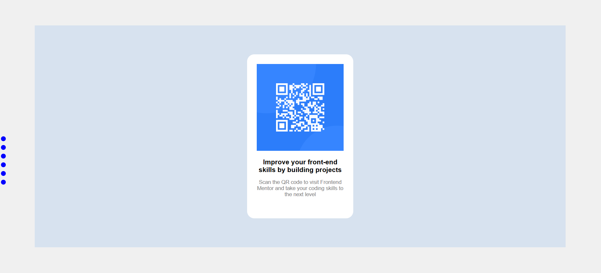

# Frontend Mentor - QR code component solution

This is a solution to the [QR code component challenge on Frontend Mentor](https://www.frontendmentor.io/challenges/qr-code-component-iux_sIO_H). Frontend Mentor challenges help you improve your coding skills by building realistic projects. 

## Table of contents

- [Overview](#overview)
  - [Screenshot](#screenshot)
  - [Links](#links)
- [My process](#my-process)
  - [Built with](#built-with)
  - [What I learned](#what-i-learned)
  - [Continued development](#continued-development)
  - [Useful resources](#useful-resources)

**Note: Delete this note and update the table of contents based on what sections you keep.**

## Overview

Creating a web page with a QR code. The web page has scalling for different devices (Desktop and Modile device). 
### Screenshot



### Links

- Solution URL: [Click here](https://github.com/SonopoKhiba/SonopoKhiba.github.io)
- Live Site URL: [Click here](https://sonopokhiba.github.io/)

## My process

First
Use HTML to strcture the web page.

Second
Use CSS to style the web page accodinglly, and make sure it works on diffarent screens.

### Built with

- Semantic HTML5 markup
- CSS for styling 
- Flexbox
- Mobile-first workflow

### What I learned

I learned how scall a web page for different screens. That when you style using CSS, if the element are not listed in a specific way. Some styling doesnt work. I also learned that div is used for larger styling so if i want to make small things like dots its common practice to use span. 

To see how you can add code snippets, see below:

```html
<span>I wanted to use div but i found that span is more ideal </span>
```
```css
@media (max-width: 375px) {
    #container {
        background-color: #D7E2EF;
        padding: 50px;
        display: flex;
        justify-content: center;
        align-items: center;
        width: 1000px;
        height: 490px;
    }
}
```

### Continued development

I want to be able to know how CSS manipulation works, layaring of elements and which tags are best ideal for which usage like the span.

### Useful resources

ChatGPT helped me with learning the uses of different tags and CSS elements.

